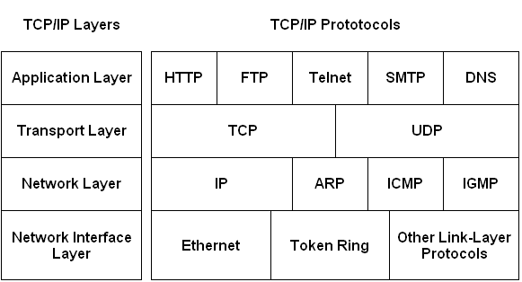

https://youtu.be/GmiXDvcCFDY

[Слайды](https://docs.google.com/presentation/d/1ElIhd_IWJhQwPI1i8MHQ1RRUeqwUc7lhGiuUtSHXA_E/edit?usp=sharing)

## Слои стека протоколов \(современный/упрощенный вариант\)

### Network Interface Layer

Отвечает за передачу данных в физическом пространстве в рамках одной сети. Включает разные протоколы преобразование физических сигналов в последовательность битов. Также определяет адресация в сети. Самые распространенные протоколы: Ethernet, WiFi, 4G. 

### Network Layer

Отвечает за межсетевую адресацию узлов и в глобальной сети Интернет. Ключевые протоколы Internet Protocal \(IP\), Address Resolution Protocol \(ARP\). 

### Transport Layer

Отвечает за указание программы получателя данных \(порт\). В случае с Transmission Control Protocol \(TCP\) открывает канал связи между приложениями, а также контролирует и гарантирует доставку данных. User Datagram Protocol \(UDP\) дает возможность отправлять данные с меньшими задержками \(чем TCP\), но при этом не гарантирует их доставку. 

### Application Layer

Протокол уровня приложений. Взаимодействие приложение с сервером происходит на этом уровне. Работа браузера \(HTTP\), почтовых клиентов \(SMPT\), потокового видео \(RTMP, WebRTC\), веб серверов происходит на этом уровне. 
