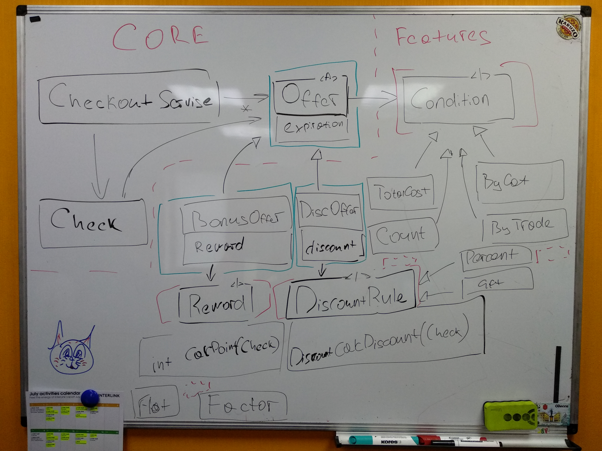

Приложение расчета итогов по чеку и количеству начисленных балов в Сильпо. Исходный код на Java [https://gitlab.in6k.com/meetup/oop-workshop](https://gitlab.in6k.com/meetup/oop-workshop). 

## Часть 1 – Полиморфизм

1. [Создать проект с поддержкой xUnit тестов](https://docs.microsoft.com/ru-ru/dotnet/core/testing/unit-testing-with-dotnet-test). Краткое описание атрибутов и доступных методов проверки в [https://xunit.net/docs/comparisons](https://xunit.net/docs/comparisons). 
:::tip
Для быстрого старта воспользуйтесь [заготовкой решения с поддержкой тестов](https://github.com/alexanderko/silpo-bonus-csharp-xunit). 
:::
2. Для каждого исходного [коммита в репозитории](https://gitlab.in6k.com/meetup/oop-workshop/-/commits/master), начиная с [первого](https://gitlab.in6k.com/meetup/oop-workshop/-/commit/1642d713b5d364c716281ccbe485fc9c300e115f) 
   1. Просмотреть соответствующую [видео-запись](https://www.youtube.com/watch?v=gzC2mokZ4Bw&list=PLNih7cQiUOFu2zetyFQ3fud2kfR7QocEi) процесса написания существующего кода. По ходу видео рассматривается процесс написание Unit тестов и суть принципа инкапсуляции. Постепенно подходим к наследования и полиморфизму.  
   2. Написать соответствующий тест, как в коммите и на видео
   3. Написать реализацию кода, что бы тест прошел
3. Завершить рефакторинг кода – Разнести полиморфное поведение по классам `AnyGoodsOffer` и `FactorByCategoryOffer`

## Часть 2 – Шаблон проектирования Template Method

- [ ] Реализовать возможность использовать предложения до закрытия чека \(во время покупки\)
- [ ] Реализовать проверку на срок годности предложения. Использовать шаблон проектирования Template Method .

### Материалы

- [Что такое Шаблон проектирования](https://refactoring.guru/design-patterns/what-is-pattern)
- [Зачем изучать шаблоны](https://refactoring.guru/design-patterns/why-learn-patterns)
- [Каталог шаблонов](https://refactoring.guru/design-patterns/catalog)
   - [Порождающие](https://refactoring.guru/design-patterns/creational-patterns)
   - [Структурные](https://refactoring.guru/design-patterns/structural-patterns)
   - [Поведенческие](https://refactoring.guru/design-patterns/behavioral-patterns)
- Шаблон [Template Method](https://refactoring.guru/design-patterns/template-method)

## Часть 3 – Шаблон проектирования Strategy *

:::note
Это непростое дополнительное задание для тех, кто справится с первыми двумя. 
:::

- [ ] Реализовать начисление баллов за покупку конкретной торговой марки или продукта
- [ ] Реализовать предложение, которое дает скидку на продукт \(50% скидки, подарок за 1 у.е\).
- [ ] Устранить дублирование кода и проблему комбинирования вознаграждения \(`Reward`\) и условия его применения \(`Condition`\) с помощью шаблона проектирования Strategy.
   1. Выделить интерфейс `Reward` и реализовать типы flat\(+amount балов\), factor\(\*factor балов\) и скидку
   2. Выделить интерфейс `Condition` и реализовать `TotalCost`, `CostByCategory` и по производителю/конкретному товару.

### Материалы

1. Шаблон [Strategy](https://sourcemaking.com/design_patterns/strategy)
2. Фото финальной диаграммы классов

